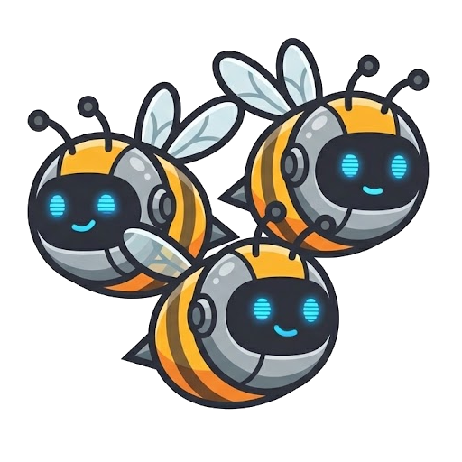

# 🐝 AgentSwarm

**A Recursive, Functional, and Type-Safe Framework for Autonomous AI Agents.**

[](https://appfactory.it)



**AgentSwarm** is a next-generation agentic orchestration framework designed to solve the critical issues of **Context Pollution** and **Complex Orchestration** in multi-agent systems.

Unlike chat-based frameworks (like AutoGen) or static graph frameworks (like LangGraph), AgentSwarm treats agents as **Strongly Typed Asynchronous Functions** that operate in isolated environments ("Tabula Rasa"), natively supporting recursion and Map-Reduce patterns.

## 🚀 Why AgentSwarm?

Current architectures suffer from two main problems:
1.  **Context Pollution:** Sub-agents inherit the parent's entire chat history, wasting tokens, increasing latency, and confusing the model.
2.  **Boilerplate Hell:** Defining dynamic recursive graphs requires complex configuration and rigid state definitions.

**AgentSwarm solves these problems:**

* **🧠 Tabula Rasa Execution:** Every invoked agent starts with a *clean* context. The sub-agent receives only the specific input required, executes the task, and returns the output. No noise, no context window overflow.
* **📦 Native Blackboard Pattern:** Agents don't pass massive raw text strings back and forth. They use a shared **Key-Value Store** to manipulate, transform, and merge data, exchanging only references (Keys).
* **🛡️ Type-Safe by Design:** Built on Pydantic and Python Generics. Agent inputs and outputs are validated at runtime, and JSON schemas for the LLM are generated automatically from type hints.
* **⚡ Implicit Parallelism:** The `ReActAgent` engine automatically handles parallel tool execution (Map) and result aggregation (Reduce) without complex graph definitions.

## 🚀 Quick Start

Creating a complex, type-safe agent is as simple as defining a class. Here is a Researcher that uses a Scraper:

```python
from pydantic import BaseModel, Field
from agentswarm.agents import BaseAgent, ReActAgent
from agentswarm.datamodels import Context, Message

# 1. Define your Input schema
class ScraperInput(BaseModel):
    url: str = Field(description="The URL to scrape")

# 2. Create a specialized Agent
class ScraperAgent(BaseAgent[ScraperInput, str]):
    def id(self) -> str: return "scraper"
    
    async def execute(self, user_id: str, context: Context, input: ScraperInput) -> str:
        # Business logic: scrape the web...
        return f"Content of {input.url}: AgentSwarm is awesome!"

# 3. Create a Master Agent that coordinates others
class ResearchMaster(ReActAgent):
    def id(self) -> str: return "researcher"
    
    def prompt(self, user_id: str) -> str:
        return "You are a professional researcher. Use the scraper to gather info."

    def available_agents(self, user_id: str) -> list[BaseAgent]:
        return [ScraperAgent()]

# 4. Run it!
import asyncio
from agentswarm.datamodels import LocalStore, Message, Context
from agentswarm.llms import GeminiLLM
from google.genai import Client

async def main():
    # Setup dependencies
    client = Client(api_key="YOUR_API_KEY")
    llm = GeminiLLM(client=client, model="gemini-3-flash-preview")
    store = LocalStore()
    
    # Create the agent
    master = ResearchMaster()
    
    # Initialize Context with a user request
    context = Context(
        trace_id="unique-trace-id",
        messages=[Message(role="user", content="Visit appfactory.it and tell me what they do.")],
        store=store,
        default_llm=llm
    )
    
    # Execute!
    responses = await master.execute("user-123", context)
    
    for msg in responses:
        print(f"[{msg.role}]: {msg.content}")

if __name__ == "__main__":
    asyncio.run(main())
```

## 🛠️ Architecture

AgentSwarm is built on three fundamental concepts:

### 1. Agent-as-a-Function
Every agent is a class inheriting from `BaseAgent[Input, Output]`. There are no "nodes" or "edges" to manually define. Orchestration emerges naturally from the functional calls between agents.
Moreover, agents are **strongly typed** and **asynchronous** by design, making them easy to compose and debug. When errors occur, they are propagated as standard exceptions, that can be managed by agents at different levels.

### 2. The "Store" (Shared Memory)
Instead of overloading the chat context, agents use the `Store` to manage information. We provide a set of agents to ease the management of the store:
* **GatheringAgent:** Retrieves data from the store for display or processing.
* **TransformerAgent:** Transforms data in the store (e.g., summarize, filter) using natural language commands and returns a new Key, keeping the context light.
* **MergeAgent:** Combines multiple data keys into a single entity.

### 3. Recursive Map-Reduce
The Map-Reduce pattern is a powerful way to decompose complex tasks into smaller, parallelizable subtasks. It is used since decades in parallel computing. With AgentSwarm, we borrow this pattern to ease the orchestration of complex tasks, preventing context pullution or exosting, prefering to use the store as a shared memory.
A `MapReduceAgent` can decompose complex tasks, dynamically instantiate clones of itself or other agents, and execute work in parallel, avoiding deadlocks via instance isolation.

### 4. Interoperability & Hybrid Execution
AgentSwarm is designed to be an open ecosystem, not a walled garden.
* **Protocol Agnostic:** It (will) supports the **Model Context Protocol (MCP)** and **Agent-to-Agent (A2A)** standards, allowing your agents to interact seamlessly with external tools and third-party agent networks. You can also easily wrap existing **LangChain** tools and run them within the Swarm.
* **Hybrid Runtime:** Each agent can be executed locally, or remotly, exploiting **AWS** or **Google Cloud** services. Also the Store can be a remote key-value store, like Redis.

## 🤝 Contributors

We welcome contributions from the community! Whether it's a bug fix, a new feature, or improving documentation, your help is appreciated.

[](https://github.com/ai-agentswarm/agentswarm/graphs/contributors)

*Made with [contrib.rocks](https://contrib.rocks).*

## ❤️ Support & Sponsorship

AgentSwarm is an open-source project maintained with ❤️. If you or your company find it useful, please consider supporting its development.

### 🏆 Primary Sponsor

[](https://appfactory.it)

**[AppFactory](https://appfactory.it)** is the primary sponsor of AgentSwarm. We specialize in building production-ready AI agent architectures and advanced automation systems.

---

*Interested in sponsoring? [Get in touch!](mailto:info@appfactory.it)*

