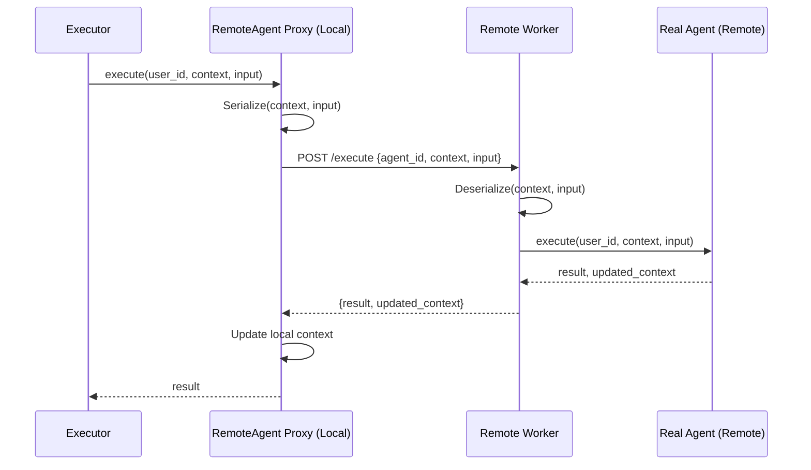

# Remote Agent Execution Protocol

The Remote Agent Execution Protocol allows agents to be defined in one environment (the "Executor") while being executed in another environment (the "Worker").

## High-Level Overview

In this model, the Executor holds a proxy agent (e.g., `HttpRemoteAgent`) that implements the `BaseAgent` interface. When `execute()` is called on this proxy, it serializes its current `Context` and `Input` and transmits them to the Worker. The Worker performs the actual execution and returns the updated `Context` and the `Result`.



## Protocol Specification (REST)

The default implementation uses a REST-based protocol.

### 1. Synchronous Execution
**Endpoint**: `POST /execute`

**Request Body**:
```json
{
  "user_id": "string",
  "agent_id": "string",
  "context": {
    "trace_id": "string",
    "step_id": "string",
    "parent_step_id": "string",
    "messages": [ ... ],
    "store": {
        "__class__": "full.class.Path",
        "config": { ... }
    },
    "thoughts": [ ... ],
    "usage": [ ... ],
    "tracing": { "__class__": "...", "config": { ... } },
    "feedback": { "__class__": "...", "config": { ... } }
  },
  "input": { ... }
}
```

**Response Body**:
```json
{
  "result": { ... },
  "updated_context": { ... }
}
```

> [!NOTE]
> The `updated_context` includes the delta for messages, thoughts, and usage. Store synchronization is expected to happen at the storage layer (e.g., shared Redis/Database) and is not passed in the HTTP payload.

### 2. Asynchronous Execution (Polling)
**Endpoint**: `POST /execute/async`
Returns a `handler_id`.

**Status Endpoint**: `GET /execute/status/{handler_id}`
Returns the current status and the result if completed.

---

## Security and Configuration

### Secret Management
Secrets (API keys, passwords, database URLs) **MUST NOT** be transmitted in the protocol payload.

### Reference-based Configuration
Instead of full connection strings, use named configuration references. For example, a Remote Store might be configured as follows:

```json
{
  "__class__": "agentswarm.datamodels.redis_store.RedisStore",
  "config": {
    "connection_ref": "PROD_REDIS"
  }
}
```

The Worker environment is responsible for mapping `"PROD_REDIS"` to the actual credentials stored in its own secure environment.

### Serialization Safety
Local-only components (like `LocalStore` or `LocalTracing`) will raise a `RemoteExecutionNotSupportedError` if an attempt is made to serialize them for remote execution, preventing accidental leaks of local files or memory-only state.
